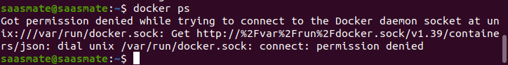

# Docker 
- [Udemy Course](https://www.udemy.com/docker-from-zero-to-hero/learn/lecture/15481052#overview)
## Docker File
```
FROM centos
RUN yum -y install httpd
CMD apachectl -DDOREGROUND
```
## Install Docker on Ubuntu
- [Docker Installation](https://docs.docker.com/install/linux/docker-ce/ubuntu/)

 - `sudo apt-get update`

 - `sudo apt-get install apt-transport-https ca-certificates curl gnupg-agent software-properties-common -y`

 - `curl -fsSL https://download.docker.com/linux/ubuntu/gpg | sudo apt-key add -`

 - `sudo add-apt-repository "deb [arch=amd64] https://download.docker.com/linux/ubuntu $(lsb_release -cs) stable"`

 - `sudo apt-get update`

 - `sudo apt-get install docker-ce docker-ce-cli containerd.io -y` or `sudo apt-get install docker.io`

 - `sudo docker run hello-world`

## Common Commands
 - pull official docker image : `docker pull <REPOSITORY>` or `docker pull <REPOSITORY>:<TAG>`
 - Find or List installed images : `docker images`
 - Delete or Remove image : `docker rmi <REPOSITORY>` or `docker rmi <REPOSITORY>:<TAG>` or `docker rmi <IMAGE ID>`
 - View running Docker Images : `docker ps -l` or `docker ps -a` or `docker ps --no-trunc`
 - Run or create a container(-d for detached mode(run background)) : `docker run -d <REPOSITORY>:<TAG>`
 - Delete or Remove container(-f for Force) : `docker rm <CONTAINER ID>` or `docker rm -f <CONTAINER ID>`
 - Create image from own docker file : `docker build --tag <NEW REPOSITORY NAME>:<TAG> <Dockerfile or . >`

## Hints & Tips

#### `docker ps` permission error:

 - Get current user name :
  - `whoami`
 - Add docker group to sudoer group :
  - `sudo usermod -aG docker ubuntu`
 - Check or List groups:
  - `groups`
 - Check OS id:
  - `id`
 - Exit from terminal
  - `exit`

#### Enable Docker in startup service
 - `sudo systemctl enable docker`

## Create and Run my Own docker image and run container
 - Create Directory : `mkdir docker-images`
 - Change directory : `cd docker-images`
 - Create text file : `vi Dockerfile`
 - Copy Content,
```
FROM ubuntu

RUN apt-get install apache2 curl

CMD apachectl -DFOREGROUND
```
 - [Create or build image from own docker file](https://docs.docker.com/engine/reference/builder/) : `docker build --tag ubuntu_apache2:v1 .`
 - Run Contaniner: `docker run -d -p 9090:80 --name ubuntu-test ubuntu_apache2:v1`
